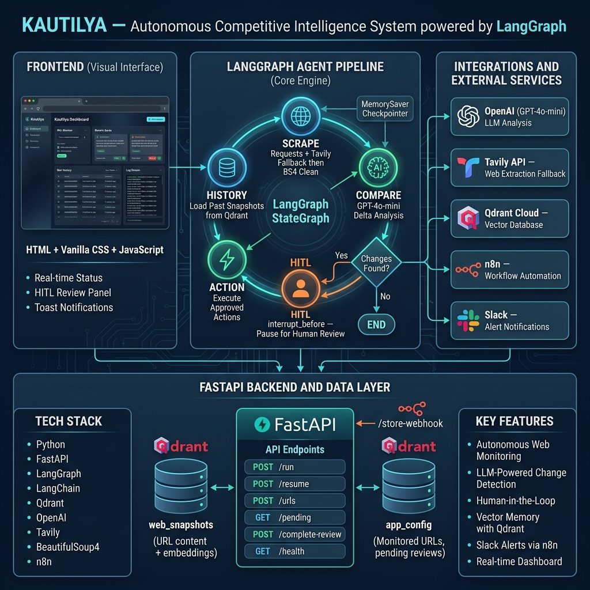

<div align="center">

# 👁️ KAUTILYA

### *Autonomous Competitive Intelligence System powered by LangGraph.*

[](https://python.org)
[](https://fastapi.tiangolo.com)
[](https://langchain.com/langgraph)
[](https://qdrant.tech)
[](LICENSE)

**Track competitors. Detect strategic shifts. Never miss a move.**

[Quick Start](#-quick-start) · [Architecture](#-high-level-architecture) · [Features](#-key-features) · [Tech Stack](#-tech-stack) · [Use Cases](#-workflows--use-cases)

</div>



## 🔮 The Intelligence Shift

Traditional competitive intelligence requires analysts to manually refresh competitor pricing pages, read through feature releases, and try to spot what changed. **Kautilya automates this entirely.**

Feed it a list of URLs, and it will autonomously scrape them, compare the current state against its vector memory of the past, and use an LLM (GPT-4o-mini) to extract only **strategic deltas** (pricing changes, new features, leadership shifts). It filters out the noise (timestamps, dynamic UI elements) and surfaces the signal. 

When a strategic change is detected, Kautilya pauses execution using LangGraph's **Human-in-the-Loop (HITL)** mechanism. You review the findings on a sleek dashboard. Once approved, it triggers downstream workflows via n8n and Slack.

---

## ✨ Key Features

| Feature | Description |
|:--------|:------------|
| **🧠 LangGraph Agent Pipeline** | A robust 5-node StateGraph (Scrape → History → Compare → HITL → Action) that orchestrates the entire intelligence gathering process. |
| **🗄️ Vector-Backed Memory** | Uses **Qdrant Cloud** to store both configuration data and historical webpage snapshots. Leverages payload indexing for lightning-fast retrieval without full-collection scans. |
| **🕸️ Multi-Stage Scraper** | A resilient 5-stage scraping pipeline. Starts with direct requests for fresh content, falls back to **Tavily API** for JS-rendered/Cloudflare pages, and uses targeted BeautifulSoup selectors to strip noise. |
| **🕵️ LLM Delta Analysis** | Uses **GPT-4o-mini** with temperature 0.0 to compare historical and current snapshots. Prompts are heavily engineered to ignore formatting changes and only flag strategic shifts. |
| **⏸️ Human-in-the-Loop (HITL)** | Built-in review mechanism. The graph pauses execution (`interrupt_before`) when changes are found, awaiting human approval before triggering external alerts. |
| **🖥️ Glassmorphism Dashboard** | A modern, responsive UI built with HTML/Vanilla CSS/JS to monitor URLs, view run history, and approve/reject detected changes in real-time. |
| **⚙️ Workflow Automation** | Integrated with **n8n** for orchestrating downstream actions like sending formatted Block Kit alerts to **Slack**. |
| **🔒 Secure Configuration** | Zero hardcoded secrets. Uses `pydantic-settings` to manage API keys and endpoints securely via `.env` files. |

---

## 🎯 Workflows & Use Cases

### 1. 💰 Pricing Page Monitoring

**The Setup:** Add `https://competitor.com/pricing` to Kautilya.

**What happens:**
1. Kautilya scrapes the page and saves a baseline.
2. Next week, the competitor drops their enterprise tier price by 20%.
3. Kautilya's LLM detects this specific strategic change, ignoring a newly added cookie banner.
4. Execution pauses. You see the change on your dashboard.
5. You click "Approve", and an n8n workflow instantly alerts your sales team on Slack.

---

### 2. 🚀 Feature Matrix Tracking

**The Setup:** Track a competitor's integration or feature list page.

**What happens:**
1. The competitor quietly adds a new integration with Salesforce.
2. Kautilya detects the addition during its scheduled run.
3. The LLM extracts the context ("Competitor X now supports Salesforce").
4. After your HITL approval, the insight is logged and distributed.

---

## 🏗️ High-Level Architecture

```text
┌─────────────────────────────────────────────────────────────────┐
│                     KAUTILYA SYSTEM                            │
│                                                                 │
│  ┌──────────┐    HTTP     ┌─────────────────────────────────┐  │
│  │ Frontend │◄──────────►│       FastAPI (main.py)          │  │
│  │ (static) │            │  /run /resume /status /pending   │  │
│  └──────────┘            └──────────────┬──────────────────┘  │
│                                         │                       │
│                          ┌──────────────▼──────────────────┐   │
│                          │     LangGraph StateGraph         │   │
│                          │                                  │   │
│                          │  [scrape]→[history]→[compare]   │   │
│                          │       ↓              ↓           │   │
│                          │    [END]         ⏸ PAUSE         │   │
│                          │                  ↓               │   │
│                          │             [hitl]→[action]      │   │
│                          └──────┬──────────────────────────┘   │
│                                 │                               │
│  ┌──────────────────┐   ┌───────▼────────┐  ┌──────────────┐  │
│  │  MemorySaver     │   │  Qdrant Cloud  │  │  OpenAI API  │  │
│  │  (checkpoints)   │   │  web_snapshots │  │  GPT-4o-mini │  │
│  │                  │   │  app_config    │  │  text-emb-3  │  │
│  └──────────────────┘   └────────────────┘  └──────────────┘  │
│                                                                 │
│  ┌──────────────────┐   ┌────────────────┐  ┌──────────────┐  │
│  │  Tavily API      │   │  n8n Workflow  │  │  Slack       │  │
│  │  JS scraping     │   │  Automation    │  │  Webhooks    │  │
│  │  fallback        │   │                │  │  Alerts      │  │
│  └──────────────────┘   └────────────────┘  └──────────────┘  │
└─────────────────────────────────────────────────────────────────┘
```

---

## 🛠️ Tech Stack

| Layer | Technology |
|:------|:-----------|
| **Agent Orchestration** | [LangGraph](https://langchain.com/langgraph) — for stateful, cyclic, and interruptible agent workflows |
| **LLM Runtime** | [LangChain](https://langchain.com/) + OpenAI (GPT-4o-mini) |
| **API Server** | FastAPI 2.0 + Uvicorn |
| **Vector Database** | Qdrant Cloud (for snapshots and config state) |
| **Web Scraping** | `requests` + `BeautifulSoup4` + Tavily API (fallback) |
| **Automation** | n8n (Webhooks & Logic) |
| **Frontend** | HTML5, Vanilla CSS (Glassmorphism), JavaScript |

---

## 🚀 Quick Start

### Prerequisites

| Requirement | Version |
|:------------|:--------|
| Python | 3.11+ |
| API Keys | OpenAI, Tavily, Qdrant |

### 1. Clone the Repository

```bash
git clone https://github.com/your-username/kautilya.git
cd kautilya
```

### 2. Setup Environment

```bash
# Create and activate a virtual environment
python -m venv .venv
source .venv/bin/activate        # macOS / Linux
# .venv\Scripts\activate         # Windows

# Install dependencies (ensure these are in your requirements.txt)
pip install fastapi uvicorn langchain langchain-openai langgraph qdrant-client beautifulsoup4 pydantic-settings requests tavily-python
```

### 3. Configuration

```bash
cp .env.example .env
```

Edit `.env` with your API keys:

```bash
OPENAI_API_KEY=your-openai-api-key
TAVILY_API_KEY=your-tavily-api-key
QDRANT_API_KEY=your-qdrant-api-key
QDRANT_URL=https://your-cluster.cloud.qdrant.io
```

### 4. Boot the Server

```bash
python main.py
```

```
INFO:     Will watch for changes in these directories: [...]
INFO:     Uvicorn running on http://0.0.0.0:8000 (Press CTRL+C to quit)
INFO:     Started reloader process [...] using WatchFiles
```

### 5. Open the Dashboard

Navigate to `http://localhost:8000/ui` in your browser to access the Kautilya Dashboard.

---

## 🔐 Security & Persistence Notes

- **API Keys**: Managed via `.env` and `pydantic-settings`. Never hardcoded.
- **CORS**: Currently set to `allow_origins=["*"]` for development. Restrict this in production.
- **Checkpoints**: Development uses `MemorySaver` (RAM). Thread states are lost on server restart. For production, switch to `PostgresSaver`.
- **Idempotency**: Qdrant upserts use a delete-before-insert pattern with UUIDs for snapshots to prevent duplication while preserving complete history.

---

## 📄 License

[MIT](LICENSE) — see the LICENSE file for details.

---

<div align="center">

**KAUTILYA** — *Intelligence, Automated.*

[⬆ Back to Top](#-kautilya)

</div>
